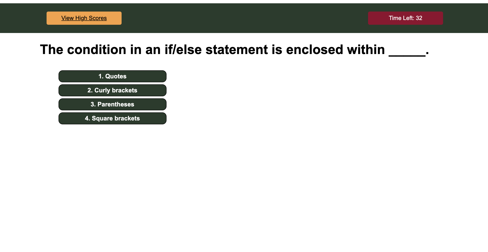
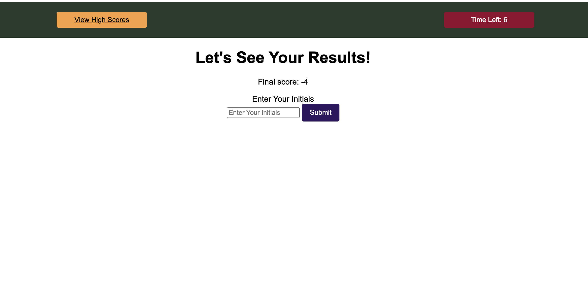

# Code Wiz Quiz

## Introduction

This exciting timed quiz is built using JavaScript and is designed to evaluate your coding skills. Put your knowledge to the test and compare your performance with others on the leaderboard. With a user-friendly interface and challenging questions, this quiz is sure to put your skills to the test. Ready to take on the challenge? Follow [this link](https://graycodesnu.github.io/code-wiz-quiz/) to access the quiz now.

 

## Table of Contents
- [Code Wiz Quiz](#code-wiz-quiz)
  - [Introduction](#introduction)
  - [Table of Contents](#table-of-contents)
  - [Goals](#goals)
  - [Results](#results)
  - [License](#license)
  - [Badges](#badges)

## Goals

The objective of this project was to develop a JavaScript quiz that satisfies the following requirements:
+ A countdown timer should start when the user clicks on the start button.
+ Each question should be displayed one at a time after the timer starts.
+ If the user selects an incorrect answer, 10 seconds should be subtracted from the timer.
+ Once the timer reaches zero, the game should end, and the user should be prompted to submit their score.
+The user's score should be stored locally after they submit it.

## Results

Despite some initial challenges with implementing the timer and question display, I was able to overcome them and get them working successfully. Interestingly, adding CSS styling in the middle of the project proved to be unexpectedly helpful in completing the project's functionality.

One of the major obstacles I encountered was with local storage, which worked initially during the testing phase, but stopped functioning properly once more functionality was added. However, with persistence and effort, I was ultimately able to restore the saving of scores to local storage. 

Overall, this project was an excellent learning experience that helped me strengthen my JavaScript skills and overcome various challenges along the way.

## License

This application is covered under .

## Badges

