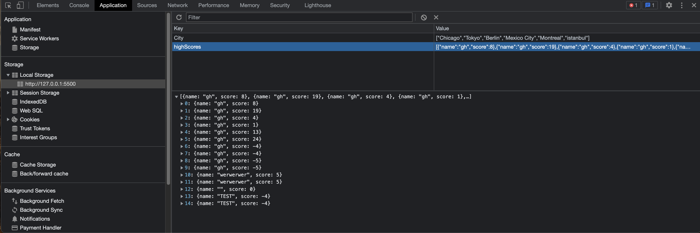

# code-wiz-quiz

## Introduction
This project is a result of our boot camp's week 4 homework assignment. Students were expected to create a JavaScript quiz that would calculate and store a user's score in local storage. The project can be found [here](https://graycodesnu.github.io/code-wiz-quiz/).

  

## Goals 
The goal of this assignment was to create a JavaScript quiz meeting the below criteria:

+ Countdown timer starts when user clicks start button
+ One question at a time displayed once timer starts 
+ If user selects incorrect answer, 10 seconds is subtracted from the timer
+ Once timer reaches 0, the game is over and the user is prompted to submit their score 
+ Once user submits their score, it is stored locally

## Results 
I was able to successfully get the timer working after struggling with that and the display of the questions. Surprisingly, adding in CSS styling halfway through the project actually helped me complete the funtionality of the project. 

Local storage was another challenge I faced, as it was working during tests at the beginning stages of the project, but stopped working once more functionality was added. Eventually, I was able to get the scores saved to local storage again, but I was unable to get the scores appended to the Quiz Wizzes high score page. 